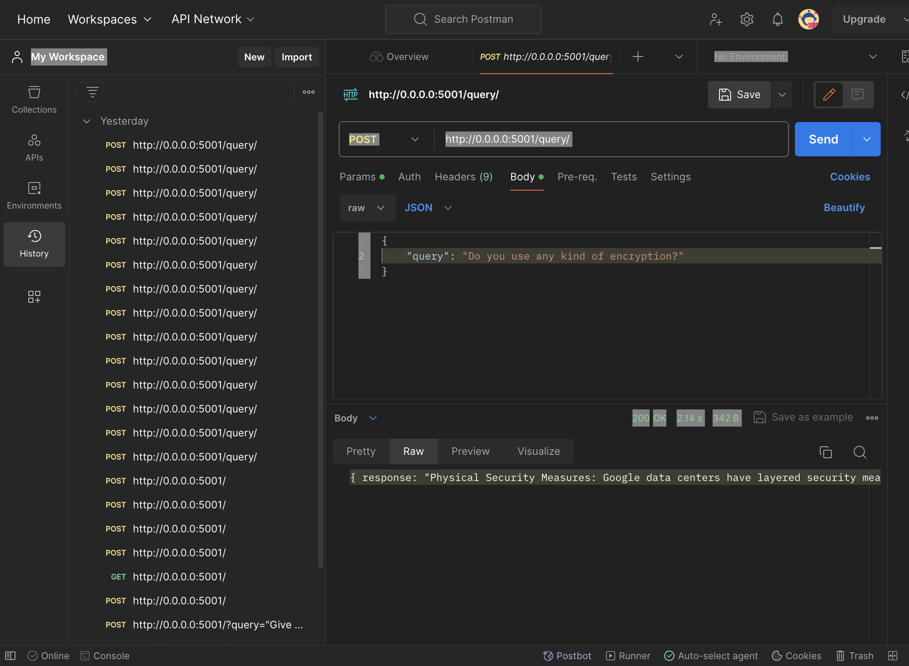

# Zania RAG agent

## APIs

POST /upload
POST /ask



## Stack

- VectorDB: [Qdrant](https://github.com/qdrant/qdrant)
- LangChain: [Langchain](https://python.langchain.com/docs/get_started/introduction)
- FastAPI: [FastAPI](https://fastapi.tiangolo.com/)

## How to get started

1. Install backend dependencies:

```bash
cd backend/app
pip install -r requirements.txt
```

2. Install frontend dependencies:

```bash
cd frontend
npm install
```

3. Start the Qdrant vector database (you need Docker). See [here](https://github.com/qdrant/qdrant) for other options information:

```bash
docker run -p 6333:6333 qdrant/qdrant
```

4. Run the FastApi server (from inside `backend` directory):

```bash
python app/main.py
```

5. Open a new terminal and start the React development server (from inside `frontend`):

```bash
npm start
```

## Change Configurations

You can change configurations in `.config` file, such as the _embedding model_, _chunk size_, and _chunk overlap_. If you plan to use Qdrant Cloud, you can or you can create your own `.env` file and set necessary api keys.

## Additional Use Cases

Although current app only support pdf files, it's very straightforward to add other types of files such as text files, etc. Also, you can easily add the open-ended chat in addition to QA over document use case.
